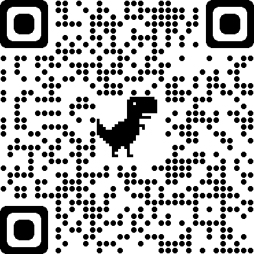

# 说明
信贷审核

此项目是 vue + node 构建的后台管理系统，所有的数据都是从服务器实时获取的真实数据，具有真实的注册、登陆、管理数据、权限验证等功能。

## 技术栈
vue2 + vuex + vue-router + element-ui + express

## 项目运行
1. 前端项目运行vue-elementui，可直接下载node压缩包直接解压，
npm start可运行
2. 后端服务 express-server
npm install安装依赖包
npm start 启动项目

## 演示地址 
http://121.43.135.81/loanWeb/#/login
管理员：admin  admin@123
普通用户: test1 123456

二维码

